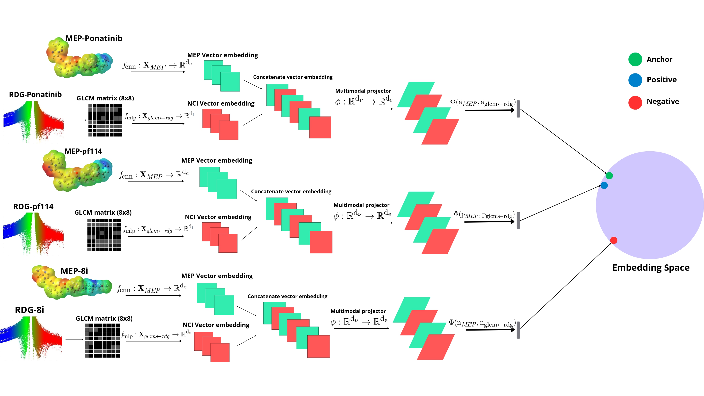

# NCIVISION: A Siamese Neural Network for Molecular Similarity Prediction using MEP and RDG Images

Official implementation of **NCIVISION**, a Python-based deep learning tool for predicting molecular similarity, from the article "NCIVISION: A Siamese Neural Network for Molecular Similarity Prediction MEP and RDG Images". The model leverages a multimodal approach, combining visual features from Molecular Electrostatic Potential (MEP) images with texture features from Reduced Density Gradient (RDG) diagrams.

## Overview

NCIVISION is designed for researchers in computational chemistry and drug discovery. It provides a novel method for quantifying the similarity between molecules by learning from both their electrostatic surface properties (MEP) and their non-covalent interaction patterns (RDG). The core of the tool is a Siamese neural network trained with triplet loss to map similar molecules close to each other in a learned embedding space.

## Architecture



The model's architecture processes two distinct inputs for each molecule in parallel:

1.  **CNN for MEP Images**: A Convolutional Neural Network (CNN) extracts high-level visual features directly from the 2D MEP images.
2.  **MLP for RDG Texture**: A Gray-Level Co-occurrence Matrix (GLCM) is calculated from the corresponding RDG image to capture its texture properties. These GLCM features are then processed by a Multilayer Perceptron (MLP).

The outputs from both streams are concatenated and passed through a final projection head, which maps the combined features into a shared 128-dimensional embedding space. The network is trained using a triplet loss function to learn a semantically rich representation of molecular similarity.

## Model Interpretability

NCIVISION includes visualization capabilities to interpret the model's decisions.

**Grad-CAM on MEP Surfaces**: Using Gradient-weighted Class Activation Mapping (Grad-CAM), we can highlight the regions on the 3D molecular surface that the CNN focuses on when making a similarity prediction.


**Attention on RDG/GLCM Features**: The model can generate attention maps to show which texture patterns from the RDG diagram are most influential.

| Original RDG Diagram (Ponatinib) | GLCM Saliency Heatmap | Attention Projected on RDG |
| :------------------------------: | :-------------------: | :-----------------------: |
|  |  |  |

## Key Components

-   **`SimilarityCNN.py`**: Defines the complete Siamese network architecture, including the CNN branch, the MLP branch for GLCM, and the final multimodal projection head.
-   **`TripletDatasetBuilder.py`**: A robust data loader class that constructs triplets (anchor, positive, negative) from the input molecular data, essential for training the Siamese network.
-   **`GLCM.py`**: Contains functions to calculate GLCM features from RDG images and to generate the attention/saliency visualizations for model interpretability.

## Requirements

The tool requires Python 3.x and several libraries, including:

-   **Python** 3.x
-   **PyTorch**
-   `pandas`
-   `numpy`
-   `scikit-image`
-   `matplotlib`
-   `opencv-python`

### Installation

To set up NCIVISION, clone the repository and install the necessary packages.

```bash
git clone https://github.com/yourusername/ncivision.git
cd ncivision
pip install -r requirements.txt
```

### Usage

## Data Preparation and Training

1. **`Organize Data`**: Place your MEP and RDG images in respective directories.
2. **`Build Triplets`**: Use the logic within **`TripletDatasetBuilder.py`** to create a list of triplets based on a pre-calculated similarity matrix or other criteria.
3. **`Train the model`**: The traininf process involves feeding these triplets into the Siamese network defined in **`SimilarityCNN.py`** and optimizing the model using the triplet loss function. A typical training script could be found in **`trainer.py`** file.

### License
NCIVISION is licensed under the MIT License. See the **`LICENSE`** file for details.

### Citation
If you use NCIVISION in your research, please cite our paper:
https://www.mdpi.com/1420-3049/30/23/4589

### Contact
For questions or contributions, please contact us at [rafaelcamposunb@gmail.com].
